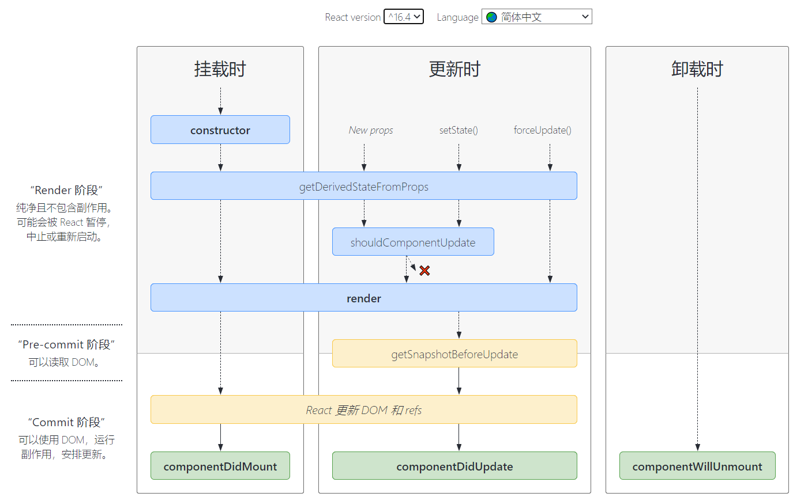

# state

> 老规矩，我们需要思考为什么要用state？
> 
> state 的主要作用是用于组件保存、控制、修改自己的可变状态。state 在组件内部初始化，可以被组件自身修改，而外部不能访问也不能修改。（**state 是私有的，并且完全受控于当前组件，是让组件控制自己的状态**）

## 向class组件中添加**局部**的state

> 这里官方文档的用词不得不说非常的细致，“局部”两个字非常有深意，不知道你注意到了吗？

官方代码如下：

```javascript
class Clock extends React.Component {
  constructor(props) {
    //这部分是es6的知识，不了解的小伙伴可以去看一下es6入门或者冴羽老师的博客
    //这里官方有句概括性很强的话：
    //Class 组件应该始终使用 props 参数来调用父类的构造函数
    super(props);
    this.state = {date: new Date()};
  }

  render() {
    return (
      <div>
        <h1>Hello, world!</h1>
        <h2>It is {this.state.date.toLocaleTimeString()}.</h2>
      </div>
    );
  }
}

ReactDOM.render(
  <Clock />,
  document.getElementById('root')
);
```

## 生命周期(先搞懂为啥)

> 1.在具有许多组件的应用程序中，当组件被销毁时释放所占用的资源是非常重要的。（原因在这里）
> 
> 2.便于在运行过程中特定的阶段执行这些方法

直接上大图



### 官方的流程

- 挂载(React.js 将组件渲染，并且构造 DOM 元素然后塞入页面的过程)
  - `constructor()`(初始化)
    - 进行state初始化和函数的this的绑定
    - **注意**：任何复杂的操作包括setState都不应该出现在该函数中
  - `static getDerivedStateFromProps(props, state)`（state 的值在任何时候都取决于 props时使用）
    - 会在调用 render 方法之前调用，并且在初始挂载及后续更新时都会被调用。
    - 该函数应返回一个对象来更新 state，如果返回 null 则不更新任何内容。
    - **此方法无权访问组件实例。**
  - `render`(返回应当渲染的元素的纯函数)
    - 当 render 被调用时，它会检查 this.props 和 this.state 的变化并返回以下类型之一
      - 由JSX创建的React元素
      - 数组或 fragments。